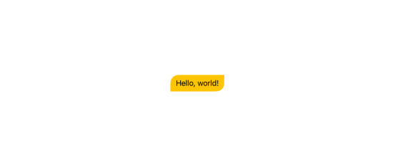

# UnevenRoundedRectangle


```swift
Text("Hello, world!")
	.padding(.horizontal, 12)
  .padding(.vertical, 8)
  .background(.yellow)
  .customUnevenRoundedRectangle(topLeadingRadius: 18, bottomTrailingRadius: 18)
```

